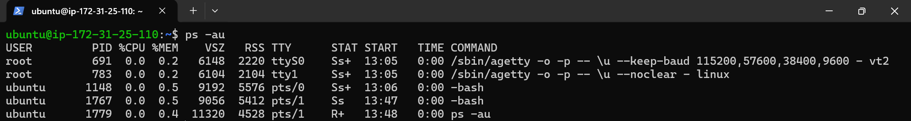
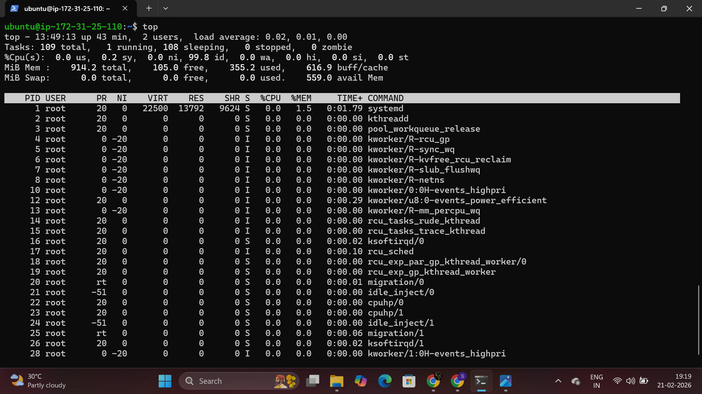
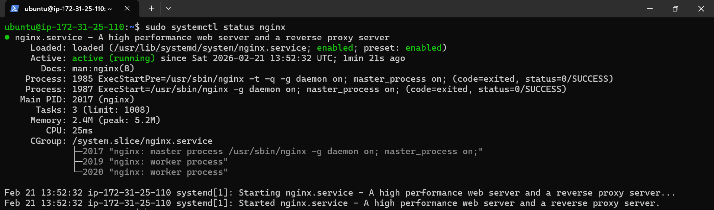
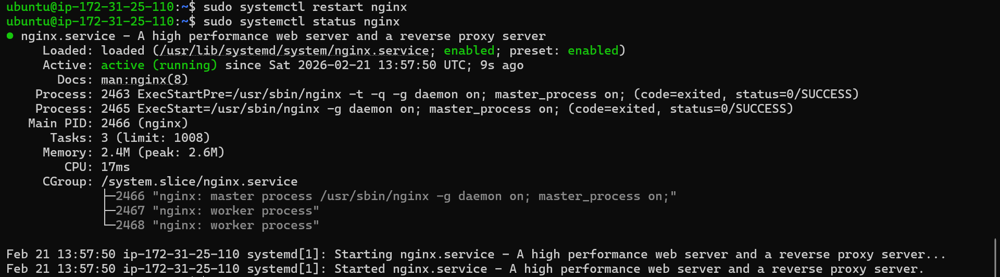
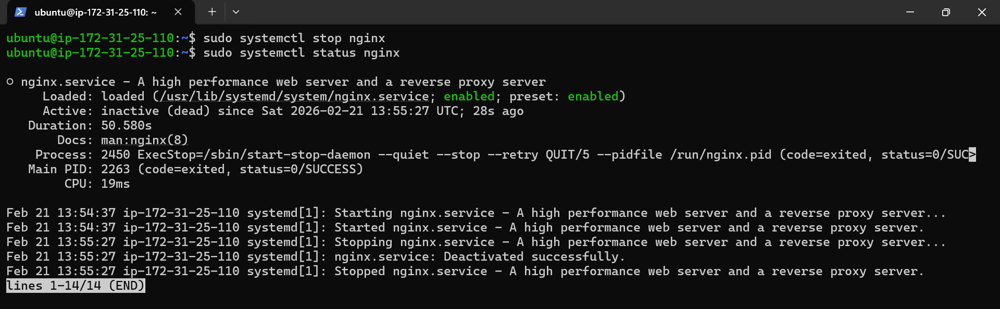

<h1>Process Commands</h1>

<b> # ps -au</b>: This command display information about running processes

<b>  # ps</b>: Process Status

<b> # -a</b>: Shows processes of all users

<b> # -u</b>: Displays the processes in a user-oriented format

_________________________________________________________________________________________________________________________

<b> # top</b>: This command display all running processes and shows all process which are consuming more resources.

_________________________________________________________________________________________________________________________

<h1>Service Commands</h1>

<b> # systemctl status service_name </b>: This command display that the services are in which state. ex: like active( running) , inactive(stopped)

<b> # systemctl restart service_name </b>: This command will restart the service

<b> # systemctl stop service_name </b>: This command will stop the service and after checking status it was showing inactive

