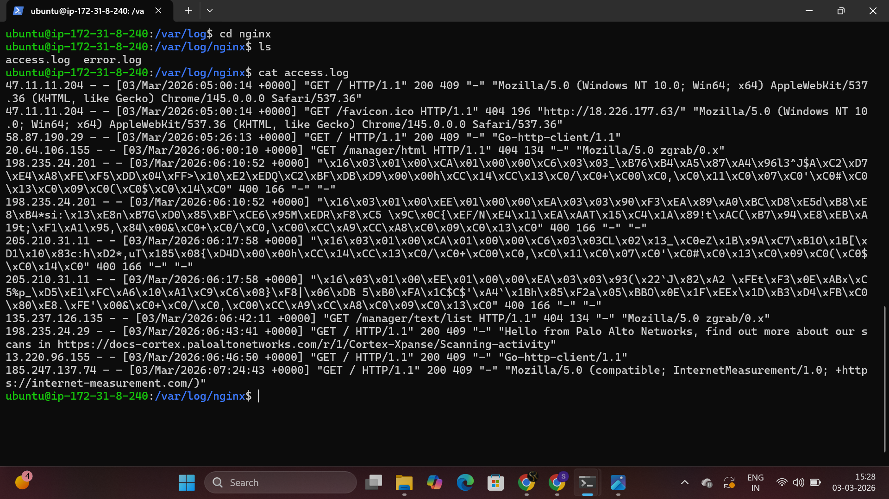
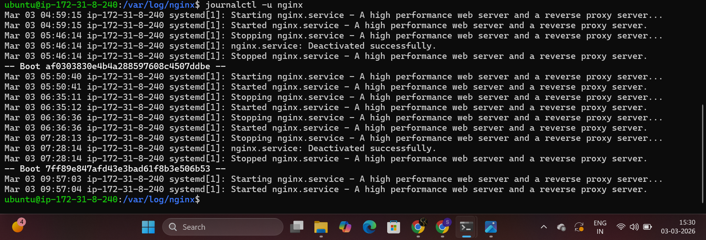
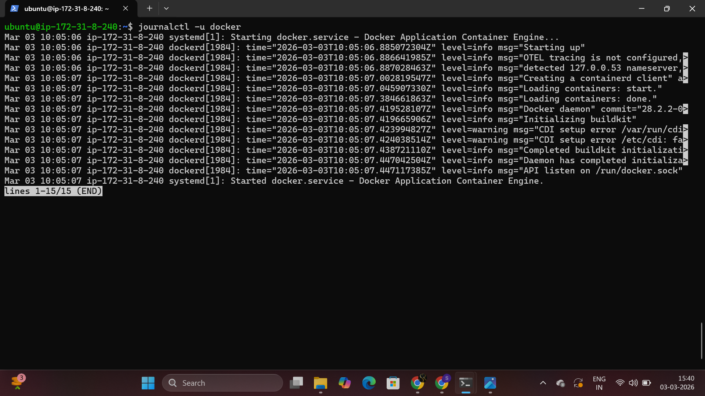

# Launch Cloud Instance & SSH Access 
step 1 : Launch EC2 instance  
  

step 2 : Connect EC2 instance with SSH 
* Command : `ssh -i .\shell.pem ubuntu@52.14.139.49`

# Install Docker and Nginx
step 1 : Update system
* Command : `sudo apt update`

step 2 : Install Nginx
* Command : `sudo apt-get install nginx -y `
  <h3>Verify nginx is running</h3>
* Command : `systemctl status nginx`

# Security Group Configuration
step 1 : Add inbound rule on HTTP port number 80 on instance security group. 
step 2 : Test Web Access: Open browser and visit: `http://<your-instance-ip>` 
You should see the Nginx welcome page! 

# Extract Nginx Logs
Step 1: View Nginx Logs
* Command : `cat /var/log/nginx/access.log`  
  

* Check nginx service logs  
* Command : `journalctl -u nginx`

Step 2 : Save logs to file
Commad : `scp -i "shell.pem" ubuntu@ec2-35-93-207-92.us-west-2.compute.amazonaws.com:/var/log/nginx/access.log .`

# Install Docker
step 1 : Install docker
* Command : `sudo apt-get install docker.io`
* Check docker service logs

# Challenges Faced
After installing docker  the docker list of all docker images is not showing
* Issue faced : `permission denied while trying to connect to the Docker daemon socket at unix:///var/run/docker.sock: Get "http://%2Fvar%2Frun%2Fdocker.sock/v1.50/containers/json": dial unix /var/run/docker.sock: connect: permission denied`

Solved after approach
* Command :  `sudo usermod -aG docker $USER`
* Command : ` newgrp docker `

  

