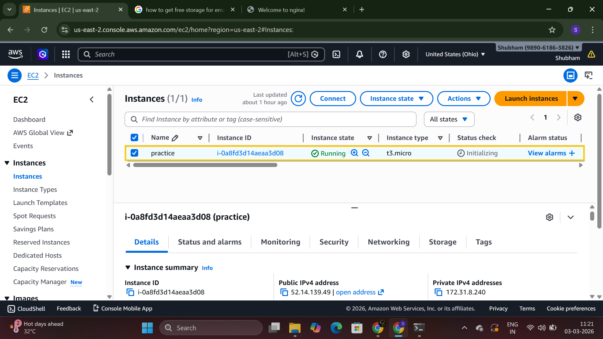
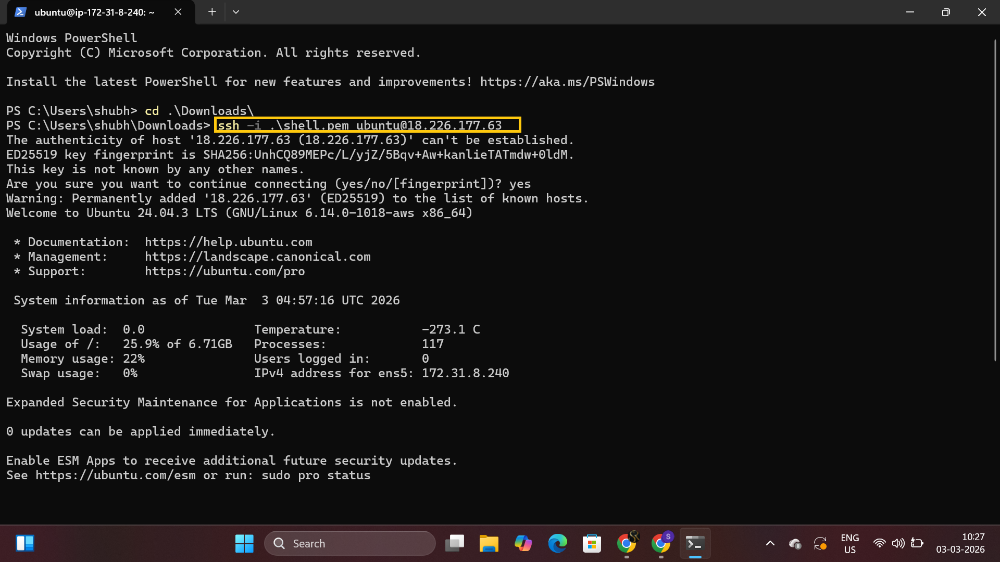
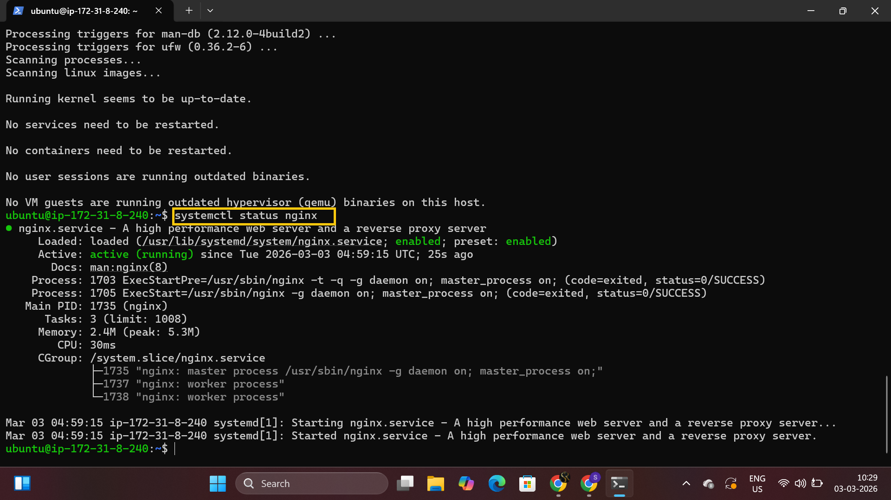
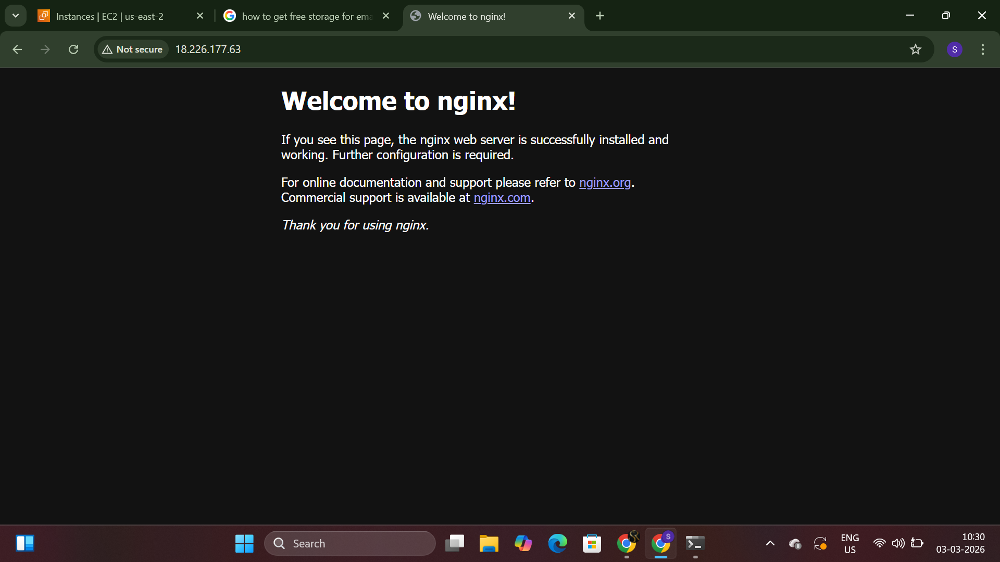

# Launch Cloud Instance & SSH Access 
step 1 : Launch EC2 instance  
  

step 2 : Connect EC2 instance with SSH 
* Command : `ssh -i .\shell.pem ubuntu@52.14.139.49`

# Install Docker and Nginx
step 1 : Update system
* Command : `sudo apt update`

step 2 : Install Nginx
* Command : `sudo apt-get install nginx -y `
  <h3>Verify nginx is running</h3>
* Command : `systemctl status nginx`

# Security Group Configuration
step 1 : Add inbound rule on HTTP port number 80 on instance security group. 
step 2 : Test Web Access: Open browser and visit: `http://<your-instance-ip>` 
You should see the Nginx welcome page! 

  

